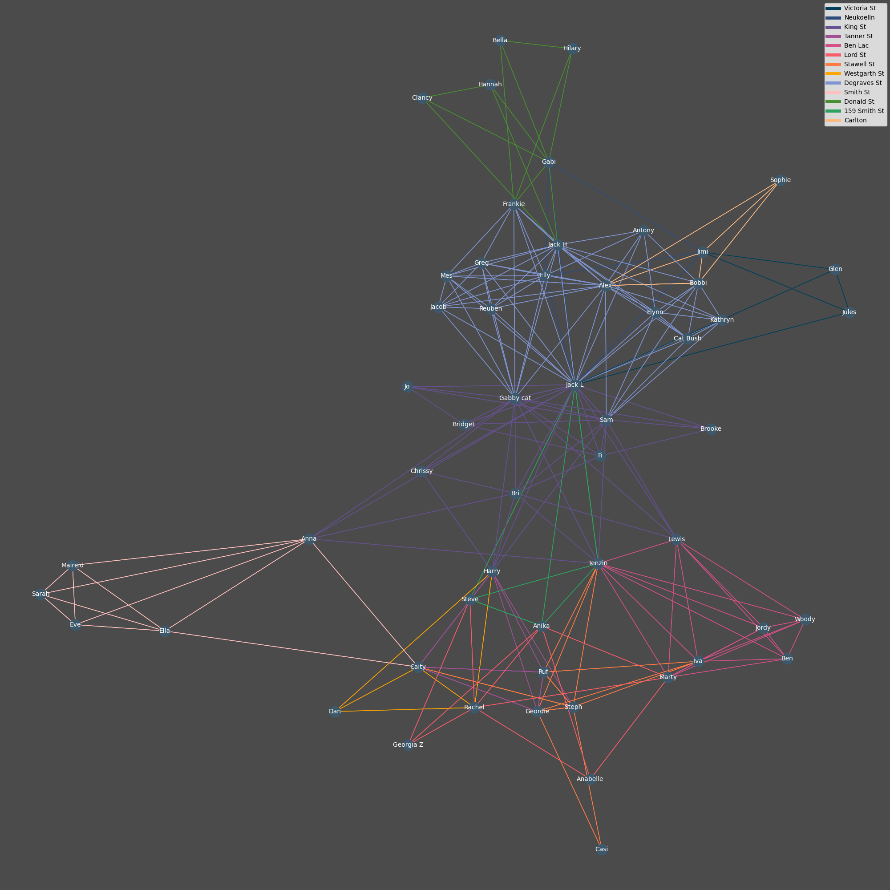

# houses

This program reads in data about people (and animals) moving in and out of different share-houses, and creates a graph connecting people who have lived together. The nodes of the graph are people (animals), and an edge connecting two nodes is colour-coded by the house that those two people lived in together.

The input data should be formatted as follows:
1. Each line represents an "event" in a particular house; e.g. someone moving in, someone moving out, or both.
2. There are three entries to a line, separated by semi-colons (;). These entries are:  
	i. the house name, address or other label;  
	ii. people moving in;  
	iii. people moving out.  
3. Where multiple people move in or out at the same time, their names should be separated by commas (,) but no spaces.
4. If nobody moves in (or out) in a particular moving event, put a single dash (-) for that entry.

E.g.:

Degraves St;Elly,Greg;-  
Degraves St;Jack L;-  
Degraves St;Alex,Greg  
Degraves St;-;Elly,Jack L  

In the example, Elly and Greg move in; Jack L moves in; Alex moves in and Greg moves out; Elly and Jack move out.

### Running the program

Write your data file and save it as data.txt  
Install the required packages:
pip install -r requirements.txt
Then run with:  
python3 map.py

